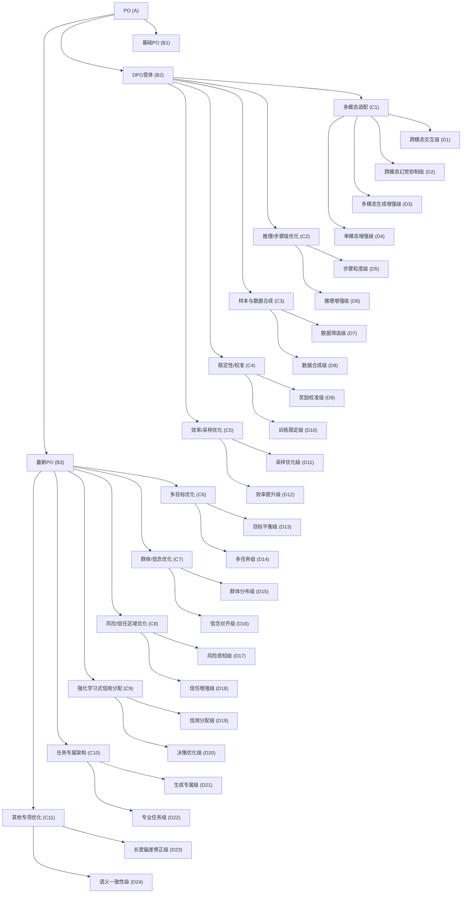

# Appendix A: Mermaid Code for Figure 1

```mermaid
graph TD
    %% --- Level 1 to 2 Connections ---
    A["PO (A)"] --> B1["基础PO (B1)"]
    A --> B2["DPO变体 (B2)"]
    A --> B3["最新PO (B3)"]

    %% --- Level 2 to 3 Connections ---
    B2 --> C1["多模态适配 (C1)"]
    B2 --> C2["推理/步骤级优化 (C2)"]
    B2 --> C3["样本与数据合成 (C3)"]
    B2 --> C4["稳定性/校准 (C4)"]
    B2 --> C5["效率/采样优化 (C5)"]
    
    B3 --> C6["多目标优化 (C6)"]
    B3 --> C7["群体/信念优化 (C7)"]
    B3 --> C8["风险/信任区域优化 (C8)"]
    B3 --> C9["强化学习式信用分配 (C9)"]
    B3 --> C10["任务专属架构 (C10)"]
    B3 --> C11["其他专项优化 (C11)"]

    %% --- Level 3 to 4 Connections ---
    C1 --> D1["跨模态交互级 (D1)"] & D2["跨模态幻觉抑制级 (D2)"] & D3["多模态生成增强级 (D3)"] & D4["单模态增强级 (D4)"]
    C2 --> D5["步骤粒度级 (D5)"] & D6["推理增强级 (D6)"]
    C3 --> D7["数据筛选级 (D7)"] & D8["数据合成级 (D8)"]
    C4 --> D9["奖励校准级 (D9)"] & D10["训练稳定级 (D10)"]
    C5 --> D11["采样优化级 (D11)"] & D12["效率提升级 (D12)"]
    C6 --> D13["目标平衡级 (D13)"] & D14["多任务级 (D14)"]
    C7 --> D15["群体分布级 (D15)"] & D16["信念对齐级 (D16)"]
    C8 --> D17["风险感知级 (D17)"] & D18["信任增强级 (D18)"]
    C9 --> D19["信用分配级 (D19)"] & D20["决策优化级 (D20)"]
    C10 --> D21["生成专属级 (D21)"] & D22["专业任务级 (D22)"]
    C11 --> D23["长度偏差修正级 (D23)"] & D24["语义一致性级 (D24)"]

    B1 ~~~ B2 ~~~ B3
    C1 ~~~ C2 ~~~ C3 ~~~ C4 ~~~ C5 ~~~ C6 ~~~ C7 ~~~ C8 ~~~ C9 ~~~ C10 ~~~ C11
    D1 ~~~ D2 ~~~ D3 ~~~ D4 ~~~ D5 ~~~ D6 ~~~ D7 ~~~ D8 ~~~ D9 ~~~ D10 ~~~ D11 ~~~ D12 ~~~ D13 ~~~ D14 ~~~ D15 ~~~ D16 ~~~ D17 ~~~ D18 ~~~ D19 ~~~ D20 ~~~ D21 ~~~ D22 ~~~ D23 ~~~ D24
```
